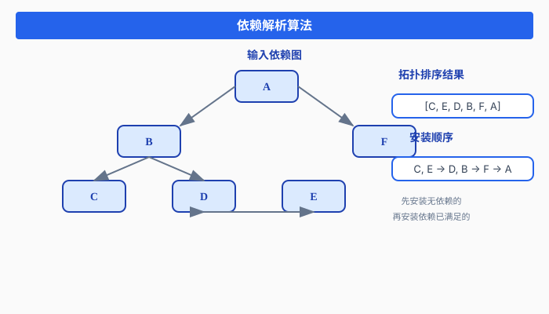
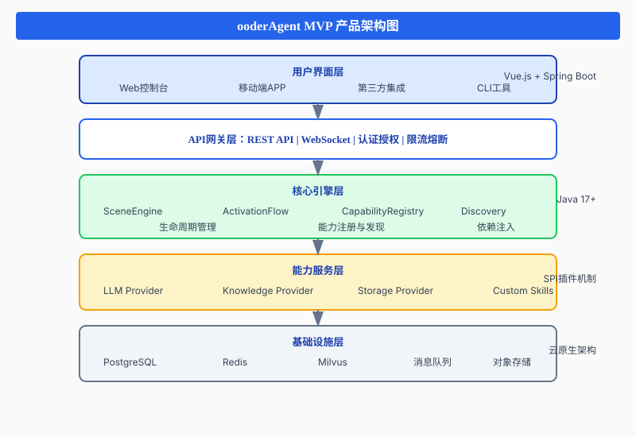

# ooderAgent 全生命周期能力管理深度解析
## 软件技能化时代的能力底座构建之道

> **作者**: Ooder Team  
> **版本**: 2.0.0  
> **日期**: 2026-03-22  
> **关键词**: 软件技能化、能力检索、Agent架构、生命周期管理、CAP协议

---

## 目录

- [术语说明](#术语说明)
- [引言：软件技能化的时代浪潮](#引言软件技能化的时代浪潮)
- [第一部分：为什么需要复杂的能力底座](#第一部分为什么需要复杂的能力底座)
- [第二部分：核心能力底座详解](#第二部分核心能力底座详解)
- [第三部分：能力管理功能介绍](#第三部分能力管理功能介绍)
- [第四部分：LLM Agent设计模式](#第四部分llm-agent设计模式)
- [第五部分：ooderAgent MVP实践](#第五部分ooderagent-mvp实践)
- [附录](#附录)

---

## 术语说明

在深入探讨之前，我们需要明确本文中使用的核心术语，以避免"能力"与"技能"等概念混淆。

### 核心术语对照表

| 中文术语 | 英文术语 | 缩写 | 定义 | 示例 |
|---------|---------|------|------|------|
| **技能** | Skill | - | 一个独立的功能单元包，包含一组相关的能力、元数据和配置。技能是ooderAgent中的部署和分发单位。 | `hr-assistant`（HR助手技能）、`weather-service`（天气服务技能） |
| **能力** | Capability | Cap | 技能内部的一个原子化功能点，可被独立调用。能力通过CAP协议寻址。 | `queryEmployeeInfo`（查询员工信息）、`sendEmail`（发送邮件） |
| **能力提供者** | Provider | - | 提供底层服务支持的组件，如LLM服务、数据库服务等。 | `OpenAIProvider`、`MilvusProvider` |
| **CAP地址** | Capability Address | CAP | 能力的统一寻址标识，格式为 `cap://skillId/capabilityName` | `cap://hr-assistant/queryEmployeeInfo` |
| **激活** | Activation | - | 将技能从"已安装"状态转换为"已激活"状态的过程，包括依赖注入和运行时初始化。 | 激活HR助手技能 |
| **场景** | Scene | - | 一组技能的集合，代表一个业务场景或应用环境。 | 企业办公场景、智能客服场景 |

### 术语关系图

```
┌─────────────────────────────────────────────────────────────────────────┐
│                        术语关系图                                        │
├─────────────────────────────────────────────────────────────────────────┤
│                                                                         │
│  Scene (场景)                                                           │
│  ┌─────────────────────────────────────────────────────────────────┐   │
│  │                                                                 │   │
│  │   Skill (技能)              Skill (技能)                        │   │
│  │   ┌───────────────────┐     ┌───────────────────┐              │   │
│  │   │ hr-assistant      │     │ email-service     │              │   │
│  │   │                   │     │                   │              │   │
│  │   │ ┌───────────────┐ │     │ ┌───────────────┐ │              │   │
│  │   │ │ Capability    │ │     │ │ Capability    │ │              │   │
│  │   │ │ chat          │ │     │ │ sendEmail     │ │              │   │
│  │   │ └───────────────┘ │     │ └───────────────┘ │              │   │
│  │   │ ┌───────────────┐ │     │ ┌───────────────┐ │              │   │
│  │   │ │ Capability    │ │────►│ │ Capability    │ │              │   │
│  │   │ │ queryInfo     │ │     │ │ scheduleEmail │ │              │   │
│  │   │ └───────────────┘ │     │ └───────────────┘ │              │   │
│  │   │       ...         │     │       ...         │              │   │
│  │   └───────────────────┘     └───────────────────┘              │   │
│  │                                                                 │   │
│  └─────────────────────────────────────────────────────────────────┘   │
│                                                                         │
│  Provider (能力提供者)                                                  │
│  ┌─────────────┐  ┌─────────────┐  ┌─────────────┐                    │
│  │ LLM服务     │  │ 数据库服务   │  │ 向量存储     │                    │
│  └─────────────┘  └─────────────┘  └─────────────┘                    │
│                                                                         │
└─────────────────────────────────────────────────────────────────────────┘
```

### 关键区分

#### 技能 vs 能力

| 维度 | 技能 (Skill) | 能力 (Capability) |
|------|-------------|------------------|
| **粒度** | 粗粒度，功能包 | 细粒度，原子功能 |
| **部署单位** | 是 | 否 |
| **寻址方式** | 通过技能ID | 通过CAP地址 |
| **生命周期** | 独立管理 | 隶属于技能 |
| **可组合性** | 包含多个能力 | 不可再分 |

**类比理解**：
- **技能** ≈ 手机App（如微信）
- **能力** ≈ App内的功能（如发送消息、朋友圈、支付）

#### 能力 vs 功能

| 维度 | 能力 (Capability) | 功能 (Function) |
|------|------------------|-----------------|
| **抽象层级** | 服务级别 | 代码级别 |
| **发现方式** | 运行时动态发现 | 编译时静态引用 |
| **寻址** | CAP协议 | 内存地址/函数名 |
| **生命周期** | 独立管理 | 随应用生命周期 |

---

## 引言：软件技能化的时代浪潮

### 0.1 从SaaS到技能化：软件形态的演进

软件行业正在经历一场深刻的变革。从本地部署到云计算，从单体应用到微服务，从SaaS（Software as a Service）到如今的**软件技能化**，每一次演进都在重新定义软件的价值边界。

```
┌─────────────────────────────────────────────────────────────────────────┐
│                        软件形态演进历程                                  │
├─────────────────────────────────────────────────────────────────────────┤
│                                                                         │
│  第一阶段：本地部署时代                                                  │
│  ───────────────────────────────────────────────────────────────────    │
│  • 软件作为产品销售                                                      │
│  • 一次性购买，永久使用                                                  │
│  • 升级维护成本高                                                        │
│  • 数据孤岛严重                                                          │
│                                                                         │
│  第二阶段：SaaS云服务时代                                                │
│  ───────────────────────────────────────────────────────────────────    │
│  • 软件作为服务订阅                                                      │
│  • 按需付费，弹性扩展                                                    │
│  • 多租户架构                                                            │
│  • 数据集中管理                                                          │
│                                                                         │
│  第三阶段：软件技能化时代 ← 我们在这里                                   │
│  ───────────────────────────────────────────────────────────────────    │
│  • 软件能力原子化                                                        │
│  • AI驱动的智能调用                                                      │
│  • 能力可发现、可组合、可编排                                            │
│  • 从"使用软件"到"对话能力"                                             │
│                                                                         │
└─────────────────────────────────────────────────────────────────────────┘
```

**什么是软件技能化？**

软件技能化是指将传统软件的功能拆解为独立的、可被AI理解和调用的"技能"或"能力"单元。用户不再需要学习复杂的软件界面，而是通过自然语言直接与软件能力交互。

| 维度 | 传统SaaS | 软件技能化 |
|------|---------|-----------|
| **交互方式** | 图形界面操作 | 自然语言对话 |
| **能力边界** | 功能模块固化 | 能力原子化、可组合 |
| **学习成本** | 需要培训和学习 | 零学习成本 |
| **调用方式** | 人工点击操作 | AI智能调度 |
| **扩展性** | 版本迭代周期长 | 即插即用 |

### 0.2 行业探索：用友本体论、钉钉悟空与小龙虾

在软件技能化的探索道路上，国内多家企业已经开始了积极的尝试。

#### 用友本体论：企业软件的语义重构

用友提出的**本体论（Ontology）**理念，试图构建企业软件的统一语义模型：

```
┌─────────────────────────────────────────────────────────────────────────┐
│                      用友本体论架构                                      │
├─────────────────────────────────────────────────────────────────────────┤
│                                                                         │
│                        ┌─────────────────┐                             │
│                        │   业务本体层    │                             │
│                        │  (Business      │                             │
│                        │   Ontology)     │                             │
│                        └────────┬────────┘                             │
│                                 │                                       │
│                    ┌────────────┼────────────┐                         │
│                    │            │            │                         │
│              ┌─────▼─────┐ ┌────▼────┐ ┌────▼─────┐                   │
│              │  财务本体  │ │ 人力本体 │ │ 供应链本体│                   │
│              └───────────┘ └─────────┘ └──────────┘                   │
│                    │            │            │                         │
│                    └────────────┼────────────┘                         │
│                                 │                                       │
│                        ┌────────▼────────┐                             │
│                        │   数据语义层    │                             │
│                        │ (Semantic Data) │                             │
│                        └─────────────────┘                             │
│                                                                         │
│  核心思想：                                                              │
│  • 统一企业业务语义模型                                                  │
│  • 跨系统的概念映射                                                      │
│  • 数据语义标准化                                                        │
│                                                                         │
└─────────────────────────────────────────────────────────────────────────┘
```

**用友本体论的价值**：
- 解决企业软件间的语义鸿沟
- 为AI理解企业业务提供基础
- 支撑智能化的业务流程编排

**面临的挑战**：
- 本体构建成本高昂
- 跨行业通用性不足
- 动态业务场景适应性差

#### 钉钉悟空：智能办公的能力聚合

钉钉推出的**悟空平台**，尝试将办公场景下的各类能力进行聚合：

```
┌─────────────────────────────────────────────────────────────────────────┐
│                      钉钉悟空平台架构                                    │
├─────────────────────────────────────────────────────────────────────────┤
│                                                                         │
│  ┌─────────────────────────────────────────────────────────────────┐   │
│  │                      悟空智能助手                                │   │
│  │                    (对话式交互入口)                              │   │
│  └───────────────────────────┬─────────────────────────────────────┘   │
│                              │                                          │
│         ┌────────────────────┼────────────────────┐                    │
│         │                    │                    │                    │
│    ┌────▼────┐         ┌────▼────┐         ┌────▼────┐               │
│    │ 日程能力 │         │ 文档能力 │         │ 会议能力 │               │
│    └─────────┘         └─────────┘         └─────────┘               │
│         │                    │                    │                    │
│    ┌────▼────┐         ┌────▼────┐         ┌────▼────┐               │
│    │ 审批能力 │         │ 通讯能力 │         │ 报表能力 │               │
│    └─────────┘         └─────────┘         └─────────┘               │
│         │                    │                    │                    │
│         └────────────────────┼────────────────────┘                    │
│                              │                                          │
│                    ┌─────────▼─────────┐                               │
│                    │   第三方应用接入   │                               │
│                    └───────────────────┘                               │
│                                                                         │
│  核心特点：                                                              │
│  • 场景化的能力聚合                                                      │
│  • 对话式的能力调用                                                      │
│  • 开放的第三方接入                                                      │
│                                                                         │
└─────────────────────────────────────────────────────────────────────────┘
```

**钉钉悟空的创新**：
- 将办公场景能力化
- 支持自然语言调用
- 构建开放的能力生态

**存在的局限**：
- 能力粒度较粗
- 缺乏统一的能力寻址机制
- 生命周期管理不完善

#### 小龙虾：软件能力检索的新探索

**小龙虾**项目代表了另一种思路——**软件能力检索**：

```
┌─────────────────────────────────────────────────────────────────────────┐
│                      小龙虾能力检索模型                                  │
├─────────────────────────────────────────────────────────────────────────┤
│                                                                         │
│  用户意图 ──────► 能力检索引擎 ──────► 能力匹配 ──────► 能力执行        │
│                      │                                                   │
│                      │                                                   │
│                      ▼                                                   │
│              ┌───────────────┐                                          │
│              │  能力索引库   │                                          │
│              │               │                                          │
│              │  • 能力描述   │                                          │
│              │  • 参数定义   │                                          │
│              │  • 调用方式   │                                          │
│              │  • 依赖关系   │                                          │
│              └───────────────┘                                          │
│                                                                         │
│  核心理念：                                                              │
│  • 软件能力可被检索                                                      │
│  • 意图到能力的智能映射                                                  │
│  • 能力的语义化描述                                                      │
│                                                                         │
└─────────────────────────────────────────────────────────────────────────┘
```

**小龙虾的贡献**：
- 提出了能力检索的概念
- 建立了能力语义描述框架
- 探索了意图-能力映射机制

**待解决的问题**：
- 能力的动态发现机制
- 能力的生命周期管理
- 分布式能力的协调

### 0.3 软件能力检索：核心论点

综合以上探索，我们可以提炼出**软件能力检索**的核心论点：

```
┌─────────────────────────────────────────────────────────────────────────┐
│                    软件能力检索核心论点                                  │
├─────────────────────────────────────────────────────────────────────────┤
│                                                                         │
│  论点一：能力原子化                                                      │
│  ───────────────────────────────────────────────────────────────────    │
│  软件功能应拆解为最小可复用的能力单元，每个能力单元：                    │
│  • 有明确的语义描述                                                      │
│  • 有标准的输入输出定义                                                  │
│  • 可独立调用和组合                                                      │
│                                                                         │
│  论点二：能力可发现                                                      │
│  ───────────────────────────────────────────────────────────────────    │
│  能力应支持动态发现机制：                                                │
│  • 运行时能力注册                                                        │
│  • 能力元数据索引                                                        │
│  • 基于语义的能力搜索                                                    │
│                                                                         │
│  论点三：能力可编排                                                      │
│  ───────────────────────────────────────────────────────────────────    │
│  多个能力应支持灵活编排：                                                │
│  • 声明式的流程定义                                                      │
│  • 自动化的依赖解析                                                      │
│  • 智能化的能力推荐                                                      │
│                                                                         │
│  论点四：能力可治理                                                      │
│  ───────────────────────────────────────────────────────────────────    │
│  能力应具备完整的治理体系：                                              │
│  • 全生命周期管理                                                        │
│  • 版本控制与灰度发布                                                    │
│  • 监控告警与故障恢复                                                    │
│                                                                         │
└─────────────────────────────────────────────────────────────────────────┘
```

### 0.4 传统软件技能化的困境

尽管行业探索丰富，但传统软件技能化仍面临诸多困境：

#### 困境一：能力边界模糊

```
传统软件功能划分：

┌─────────────────────────────────────────────────────────────────────┐
│                         ERP系统                                      │
├─────────────────────────────────────────────────────────────────────┤
│  ┌───────────┐  ┌───────────┐  ┌───────────┐  ┌───────────┐       │
│  │  财务模块  │  │  采购模块  │  │  销售模块  │  │  库存模块  │       │
│  │           │  │           │  │           │  │           │       │
│  │ • 记账    │  │ • 询价    │  │ • 报价    │  │ • 入库    │       │
│  │ • 结算    │  │ • 下单    │  │ • 订单    │  │ • 出库    │       │
│  │ • 报表    │  │ • 收货    │  │ • 发货    │  │ • 盘点    │       │
│  └───────────┘  └───────────┘  └───────────┘  └───────────┘       │
│        │              │              │              │               │
│        └──────────────┴──────────────┴──────────────┘               │
│                              │                                       │
│                              ▼                                       │
│                    功能边界交叉、重叠                                 │
│                    "创建订单"属于销售还是采购？                        │
│                    "库存查询"被多少模块调用？                          │
└─────────────────────────────────────────────────────────────────────┘

技能化后的能力单元：

┌─────────────────────────────────────────────────────────────────────┐
│                         能力注册中心                                  │
├─────────────────────────────────────────────────────────────────────┤
│                                                                     │
│  cap://order/create          创建订单能力                           │
│  cap://inventory/query       库存查询能力                           │
│  cap://finance/settle        财务结算能力                           │
│  cap://report/generate       报表生成能力                           │
│  ...                                                               │
│                                                                     │
│  每个能力有明确的边界和职责                                          │
│  能力之间通过CAP协议调用                                            │
└─────────────────────────────────────────────────────────────────────┘
```

#### 困境二：能力发现机制缺失

传统软件的能力调用方式：

```java
// 传统方式：硬编码调用
public class OrderService {
    @Autowired
    private InventoryService inventoryService;  // 编译时绑定
    
    @Autowired
    private FinanceService financeService;      // 编译时绑定
    
    public void createOrder(Order order) {
        // 直接调用，无法动态发现
        inventoryService.checkStock(order.getItems());
        financeService.calculatePrice(order);
    }
}
```

**问题**：
- 能力调用在编译时确定，无法动态发现
- 新增能力需要修改代码
- 无法实现运行时的能力替换

#### 困境三：生命周期管理混乱

```
┌─────────────────────────────────────────────────────────────────────────┐
│                    传统软件能力生命周期问题                              │
├─────────────────────────────────────────────────────────────────────────┤
│                                                                         │
│  问题1：状态不可观测                                                    │
│  ───────────────────────────────────────────────────────────────────    │
│  • 某个功能模块是否可用？无法实时感知                                   │
│  • 依赖的服务是否正常？缺乏统一视图                                     │
│                                                                         │
│  问题2：升级影响不可控                                                  │
│  ───────────────────────────────────────────────────────────────────    │
│  • 模块升级时，哪些调用方会受影响？                                     │
│  • 如何实现灰度发布？                                                   │
│  • 出问题如何回滚？                                                     │
│                                                                         │
│  问题3：故障传播                                                        │
│  ───────────────────────────────────────────────────────────────────    │
│  • 一个模块故障，影响范围难以评估                                       │
│  • 缺乏熔断、降级机制                                                   │
│  • 故障恢复依赖人工干预                                                 │
│                                                                         │
└─────────────────────────────────────────────────────────────────────────┘
```

#### 困境四：多Agent协作困难

当需要多个AI Agent协作时，问题更加突出：

```
┌─────────────────────────────────────────────────────────────────────────┐
│                    多Agent协作的挑战                                    │
├─────────────────────────────────────────────────────────────────────────┤
│                                                                         │
│     Agent A (财务助手)                                                  │
│          │                                                              │
│          │ 需要调用库存数据                                             │
│          │ 如何发现Agent B？                                            │
│          │ 如何调用Agent B的能力？                                      │
│          ▼                                                              │
│     Agent B (库存助手) ◄─────── Agent C (采购助手)                      │
│          │                           │                                  │
│          │ 需要同步状态               │ 需要查询价格                    │
│          │ 如何传递上下文？           │ 如何保证一致性？                │
│          ▼                           ▼                                  │
│     ┌─────────────────────────────────────────────────────────────┐    │
│     │                        核心问题                              │    │
│     │                                                             │    │
│     │  • Agent如何发现其他Agent的能力？                           │    │
│     │  • 能力如何统一寻址？                                       │    │
│     │  • 上下文如何传递？                                         │    │
│     │  • 生命周期如何同步？                                       │    │
│     └─────────────────────────────────────────────────────────────┘    │
│                                                                         │
└─────────────────────────────────────────────────────────────────────────┘
```

### 0.5 ooderAgent的解决方案

面对这些挑战，**ooderAgent**提出了一套完整的解决方案：

```
┌─────────────────────────────────────────────────────────────────────────┐
│                    ooderAgent解决方案全景                               │
├─────────────────────────────────────────────────────────────────────────┤
│                                                                         │
│  ┌─────────────────────────────────────────────────────────────────┐   │
│  │                     核心设计理念                                 │   │
│  ├─────────────────────────────────────────────────────────────────┤   │
│  │                                                                 │   │
│  │  1. 能力驱动架构 (Capability-Driven Architecture)               │   │
│  │     • 从"功能"到"能力"的思维转变                               │   │
│  │     • 能力作为一等公民                                         │   │
│  │                                                                 │   │
│  │  2. CAP统一寻址协议 (Capability Address Protocol)               │   │
│  │     • cap://skillId/capabilityName                             │   │
│  │     • 类似URL的能力寻址方式                                     │   │
│  │                                                                 │   │
│  │  3. 全生命周期管理 (Full Lifecycle Management)                  │   │
│  │     • 9状态模型                                                │   │
│  │     • 事务性状态转换                                           │   │
│  │                                                                 │   │
│  │  4. 声明式开发 (Declarative Development)                        │   │
│  │     • 元数据驱动                                               │   │
│  │     • 自动依赖注入                                             │   │
│  │                                                                 │   │
│  └─────────────────────────────────────────────────────────────────┘   │
│                                                                         │
│  ┌─────────────────────────────────────────────────────────────────┐   │
│  │                     技术架构                                    │   │
│  ├─────────────────────────────────────────────────────────────────┤   │
│  │                                                                 │   │
│  │                    ┌─────────────┐                              │   │
│  │                    │ Discovery   │  发现层：能力动态发现        │   │
│  │                    └──────┬──────┘                              │   │
│  │                           │                                     │   │
│  │                    ┌──────▼──────┐                              │   │
│  │                    │ Lifecycle   │  生命周期：状态管理          │   │
│  │                    └──────┬──────┘                              │   │
│  │                           │                                     │   │
│  │                    ┌──────▼──────┐                              │   │
│  │                    │ Capability  │  能力层：CAP寻址             │   │
│  │                    └──────┬──────┘                              │   │
│  │                           │                                     │   │
│  │                    ┌──────▼──────┐                              │   │
│  │                    │ Activation  │  激活层：依赖注入            │   │
│  │                    └──────┬──────┘                              │   │
│  │                           │                                     │   │
│  │                    ┌──────▼──────┐                              │   │
│  │                    │ Session     │  会话层：上下文管理          │   │
│  │                    └─────────────┘                              │   │
│  │                                                                 │   │
│  └─────────────────────────────────────────────────────────────────┘   │
│                                                                         │
└─────────────────────────────────────────────────────────────────────────┘
```

**ooderAgent如何解决传统困境**：

| 困境 | ooderAgent解决方案 |
|------|-------------------|
| 能力边界模糊 | CAP协议统一寻址，能力原子化定义 |
| 能力发现缺失 | DiscoveryProvider动态发现，元数据驱动注册 |
| 生命周期混乱 | 9状态模型，事务性状态转换，事件订阅机制 |
| 多Agent协作困难 | CAP跨Skill调用，A2A上下文传递，会话隔离 |

---

## 第一部分：为什么需要复杂的能力底座

### 1.1 传统Agent开发的困境

在构建AI Agent应用时，开发者往往面临一系列架构层面的挑战。这些挑战不是简单的技术问题，而是随着应用规模扩大而逐渐暴露的根本性架构缺陷。

#### 困境一：硬编码能力的局限性

```java
// 传统方式：能力硬编码在代码中
public class TraditionalAgent {
    private OpenAIClient llmClient;
    private WeatherService weatherService;
    private EmailService emailService;
    
    public Response handleRequest(String query) {
        if (query.contains("天气")) {
            return weatherService.getWeather();
        } else if (query.contains("邮件")) {
            return emailService.sendEmail();
        }
        // 每增加一个能力，都需要修改代码
    }
}
```

**问题分析**：
- 新增能力需要修改核心代码，违反开闭原则
- 能力之间耦合度高，难以独立测试和维护
- 无法在运行时动态扩展能力
- 能力版本管理困难

#### 困境二：单体架构的扩展瓶颈

```
┌─────────────────────────────────────────────────────────────┐
│                    传统单体Agent                             │
├─────────────────────────────────────────────────────────────┤
│  ┌─────────┐ ┌─────────┐ ┌─────────┐ ┌─────────┐           │
│  │ 天气API │ │ 邮件API │ │ 日历API │ │ 文档API │ ...       │
│  └────┬────┘ └────┬────┘ └────┬────┘ └────┬────┘           │
│       │           │           │           │                 │
│       └───────────┴─────┬─────┴───────────┘                 │
│                         ▼                                   │
│                  ┌─────────────┐                            │
│                  │  Agent核心  │                            │
│                  │  (单点故障)  │                            │
│                  └─────────────┘                            │
└─────────────────────────────────────────────────────────────┘
```

**问题分析**：
- 所有能力耦合在一个进程中，无法独立部署
- 资源竞争：一个能力的高负载影响其他能力
- 扩展困难：无法针对特定能力进行水平扩展
- 故障传播：一个能力的错误可能导致整个Agent崩溃

#### 困境三：多Agent协作的复杂性

当业务需要多个Agent协作时，问题更加突出：

```
Agent A ←──→ Agent B ←──→ Agent C
    ↑           ↑           ↑
    │           │           │
    └───────────┴───────────┘
            如何协调？
            如何传递上下文？
            如何管理生命周期？
```

**核心问题**：
- **发现机制缺失**：Agent如何发现其他Agent的能力？
- **生命周期不同步**：一个Agent重启，另一个Agent如何感知？
- **上下文传递混乱**：对话历史、用户偏好如何传递？
- **能力寻址困难**：如何统一标识和调用远程能力？

### 1.2 能力驱动架构的必然性

面对这些挑战，我们需要重新思考Agent的架构设计。**能力驱动架构**（Capability-Driven Architecture）应运而生。

#### 核心思维转变

| 维度 | 传统思维 | 能力驱动思维 |
|------|---------|-------------|
| **构建单元** | 功能（Function） | 能力（Capability） |
| **发现方式** | 硬编码引用 | 动态发现与注册 |
| **生命周期** | 应用级管理 | 能力级独立管理 |
| **寻址方式** | 内存引用 | CAP协议统一寻址 |
| **扩展方式** | 修改代码 | 插件化安装 |

#### 什么是"能力"？

在ooderAgent中，**能力（Capability）**是一个核心概念：

```java
public interface Capability {
    String getId();           // 能力唯一标识
    String getName();         // 能力名称
    CapabilityType getType(); // 能力类型
    String getDescription();  // 能力描述
    
    enum CapabilityType {
        INTERNAL,  // 内部能力：仅供Skill内部使用
        EXPOSED,   // 对外暴露：可被其他Skill调用
        ENTRY      // 入口能力：作为用户交互入口
    }
}
```

**能力 vs 功能的区别**：

```
功能（Function）:
- 代码级别的函数
- 编译时确定
- 静态引用
- 无独立生命周期

能力（Capability）:
- 服务级别的单元
- 运行时发现
- 动态寻址
- 独立生命周期管理
```

### 1.3 为什么需要全生命周期管理

每个能力都有其独立的生命周期，就像一个微服务一样。全生命周期管理解决了以下核心问题：

```
┌─────────────────────────────────────────────────────────────┐
│                    能力生命周期全景                          │
├─────────────────────────────────────────────────────────────┤
│                                                             │
│  DISCOVERED ──► INSTALLING ──► INSTALLED ──► ACTIVATING    │
│      │              │              │              │         │
│      │              │              │              ▼         │
│      │              │              │         ACTIVATED      │
│      │              │              │              │         │
│      │              │              │              ▼         │
│      │              │              │      DEACTIVATING      │
│      │              │              │              │         │
│      │              │              │              ▼         │
│      │              │              │       DEACTIVATED      │
│      │              │              │              │         │
│      │              │              │              ▼         │
│      │              │              │      UNINSTALLING      │
│      │              │              │              │         │
│      └──────────────┴──────────────┴──────────────┘         │
│                           ▼                                 │
│                      UNINSTALLED                            │
│                                                             │
└─────────────────────────────────────────────────────────────┘
```

**生命周期管理的价值**：

1. **状态可观测**：每个能力处于什么状态，一目了然
2. **操作可追溯**：谁在什么时候做了什么操作，全程记录
3. **故障可恢复**：状态异常时，可以回滚到稳定状态
4. **资源可管理**：不用的能力可以停用或卸载，释放资源

### 1.4 CAP协议：统一能力寻址的意义

在分布式系统中，**寻址**是核心问题之一。ooderAgent引入**CAP协议**（Capability Address Protocol）来解决能力寻址问题。

#### CAP地址格式

```
cap://skillId/capabilityName

示例：
cap://weather-service/getCurrentWeather
cap://email-service/sendEmail
cap://hr-assistant/queryEmployeeInfo
```

#### CAP协议的设计原则

```
┌─────────────────────────────────────────────────────────────┐
│                    CAP协议设计原则                          │
├─────────────────────────────────────────────────────────────┤
│                                                             │
│  1. 底层减少不确定性                                        │
│     • 地址固定、枚举定义、无动态计算                        │
│     • 编译时确定，运行时不变                                │
│                                                             │
│  2. 需求固定                                                │
│     • 系统支持范围固定，扩充需大版本                        │
│     • 避免运行时地址冲突                                    │
│                                                             │
│  3. 对外输出最小化                                          │
│     • 每地址一个原子能力                                    │
│     • 复杂能力用参数区分                                    │
│                                                             │
│  4. 地址固定，配置动态                                      │
│     • 地址编译时确定                                        │
│     • 配置运行时管理                                        │
│                                                             │
│  5. 上下文区分实例                                          │
│     • 多实例通过上下文区分                                  │
│     • 不分配独立地址                                        │
│                                                             │
└─────────────────────────────────────────────────────────────┘
```

#### CAP地址空间规划

| 分类代码 | 分类名称 | 地址范围 | 说明 |
|:-------:|---------|---------|------|
| SYS | 系统核心 | 0x00-0x07 | 系统核心服务 |
| ORG | 组织服务 | 0x08-0x0F | 组织架构、用户管理 |
| AUTH | 认证服务 | 0x10-0x17 | 认证、授权 |
| LLM | 大语言模型 | 0x28-0x2F | LLM、Embedding |
| KNOW | 知识库 | 0x30-0x37 | 知识库、向量存储 |
| ... | ... | ... | ... |

### 1.5 ooderAgent的设计哲学

#### 声明式 vs 命令式

**命令式**（传统方式）：
```java
// 告诉系统"怎么做"
WeatherService weather = new WeatherService();
weather.setApiKey("xxx");
weather.setEndpoint("https://api.weather.com");
weather.initialize();
String result = weather.getWeather("Beijing");
```

**声明式**（ooderAgent方式）：
```yaml
# 告诉系统"要什么"
skill:
  id: weather-service
  capabilities:
    - name: getCurrentWeather
      type: EXPOSED
      address: cap://weather-service/getCurrentWeather
  dependencies:
    - cap://http-client/default
```

系统自动完成：
- 依赖解析
- 服务发现
- 能力注入
- 生命周期管理

#### 元数据驱动的能力发现

```
┌─────────────────────────────────────────────────────────────┐
│                    元数据驱动架构                          │
├─────────────────────────────────────────────────────────────┤
│                                                             │
│  ┌─────────────┐    ┌─────────────┐    ┌─────────────┐     │
│  │ skill-index │    │ capability  │    │ dependency  │     │
│  │    .yaml    │───►│  registry   │───►│   resolver  │     │
│  └─────────────┘    └─────────────┘    └─────────────┘     │
│         │                  │                  │             │
│         ▼                  ▼                  ▼             │
│  ┌─────────────┐    ┌─────────────┐    ┌─────────────┐     │
│  │   静态配置   │    │  动态注册   │    │  自动注入   │     │
│  └─────────────┘    └─────────────┘    └─────────────┘     │
│                                                             │
└─────────────────────────────────────────────────────────────┘
```

#### 插件化架构的核心价值

```
┌─────────────────────────────────────────────────────────────┐
│                    插件化能力架构                          │
├─────────────────────────────────────────────────────────────┤
│                                                             │
│                    ┌─────────────┐                          │
│                    │ ooderAgent  │                          │
│                    │   Runtime   │                          │
│                    └──────┬──────┘                          │
│                           │                                 │
│         ┌─────────────────┼─────────────────┐               │
│         │                 │                 │               │
│    ┌────▼────┐      ┌────▼────┐      ┌────▼────┐          │
│    │ Skill A │      │ Skill B │      │ Skill C │          │
│    │ 天气服务 │      │ 邮件服务 │      │ HR助手  │          │
│    └─────────┘      └─────────┘      └─────────┘          │
│         │                 │                 │               │
│         ▼                 ▼                 ▼               │
│    独立部署          独立部署          独立部署              │
│    独立升级          独立升级          独立升级              │
│    独立扩缩          独立扩缩          独立扩缩              │
│                                                             │
└─────────────────────────────────────────────────────────────┘
```

**核心价值**：
- **解耦**：各Skill独立开发、部署、运维
- **可扩展**：按需安装新的Skill，无需修改核心
- **可替换**：同类型Skill可以替换，不影响上层应用
- **可组合**：多个Skill可以组合成复杂业务流程

---

## 第二部分：核心能力底座详解

### 2.1 Skill生命周期管理

#### 应用实例：智能客服Skill的完整生命周期

让我们通过一个智能客服Skill的实例，深入理解生命周期管理。

```yaml
# skill-index.yaml
skill:
  id: customer-service-bot
  name: 智能客服助手
  version: 1.0.0
  skillForm: SCENE
  
  capabilities:
    - name: answerQuestion
      type: ENTRY
      description: 回答用户问题
    - name: transferToHuman
      type: EXPOSED
      description: 转人工客服
    - name: queryOrderStatus
      type: INTERNAL
      description: 查询订单状态
      
  dependencies:
    - skillId: llm-service
      capability: chat
    - skillId: order-service
      capability: query
```

#### 九状态模型详解

```java
public enum SkillLifecycleState {
    DISCOVERED("已发现"),      // Skill已被发现，但未安装
    INSTALLING("安装中"),      // 正在安装
    INSTALLED("已安装"),       // 安装完成，可激活
    ACTIVATING("激活中"),      // 正在激活
    ACTIVATED("已激活"),       // 已激活，可接受调用
    DEACTIVATING("停用中"),    // 正在停用
    DEACTIVATED("已停用"),     // 已停用，可重新激活
    UNINSTALLING("卸载中"),    // 正在卸载
    UNINSTALLED("已卸载"),     // 已卸载
    ERROR("错误");             // 运行出错
}
```

**状态转换图**：

```
                    ┌──────────────────────────────────────────┐
                    │                                          │
                    ▼                                          │
┌──────────┐    ┌──────────┐    ┌──────────┐    ┌──────────┐ │
│DISCOVERED│───►│INSTALLING│───►│INSTALLED │───►│ACTIVATING│ │
└──────────┘    └──────────┘    └──────────┘    └──────────┘ │
                    │               │               │         │
                    │               │               ▼         │
                    │               │         ┌──────────┐    │
                    │               │         │ACTIVATED │    │
                    │               │         └──────────┘    │
                    │               │               │         │
                    │               │               ▼         │
                    │               │         ┌──────────┐    │
                    │               │         │DEACTIVATING│  │
                    │               │         └──────────┘    │
                    │               │               │         │
                    │               │               ▼         │
                    │               │         ┌──────────┐    │
                    │               │         │DEACTIVATED│   │
                    │               │         └──────────┘    │
                    │               │               │         │
                    │               │               ▼         │
                    │               │         ┌──────────┐    │
                    │               └────────►│UNINSTALLING│  │
                    │                         └──────────┘    │
                    │                               │         │
                    ▼                               ▼         │
               ┌──────────┐                   ┌──────────┐    │
               │  ERROR   │◄──────────────────│UNINSTALLED│   │
               └──────────┘                   └──────────┘    │
                    │                                         │
                    └─────────────────────────────────────────┘
```

#### 事务性状态转换

```java
public interface SceneSkillLifecycle {
    
    /**
     * 安装场景技能 - 事务性操作
     */
    CompletableFuture<LifecycleInstallResult> installSceneSkill(
        String sceneId, 
        String skillId, 
        Map<String, Object> config
    );
    
    /**
     * 激活场景技能
     */
    CompletableFuture<ActivateResult> activateSceneSkill(
        String sceneId, 
        String skillId, 
        String role
    );
    
    /**
     * 停用场景技能
     */
    CompletableFuture<DeactivateResult> deactivateSceneSkill(
        String sceneId, 
        String skillId
    );
    
    /**
     * 卸载场景技能
     */
    CompletableFuture<UninstallResult> uninstallSceneSkill(
        String sceneId, 
        String skillId
    );
}
```

**事务保证**：

```
┌─────────────────────────────────────────────────────────────┐
│                    事务性状态转换                          │
├─────────────────────────────────────────────────────────────┤
│                                                             │
│  安装操作 (INSTALL):                                        │
│  ┌─────────────────────────────────────────────────────┐   │
│  │ 1. 验证依赖                                          │   │
│  │ 2. 分配资源                                          │   │
│  │ 3. 注册能力                                          │   │
│  │ 4. 状态变更 → INSTALLED                              │   │
│  │                                                      │   │
│  │ 失败时: 自动回滚，状态恢复到 DISCOVERED              │   │
│  └─────────────────────────────────────────────────────┘   │
│                                                             │
│  激活操作 (ACTIVATE):                                       │
│  ┌─────────────────────────────────────────────────────┐   │
│  │ 1. 检查依赖状态                                      │   │
│  │ 2. 初始化运行时                                      │   │
│  │ 3. 建立连接                                          │   │
│  │ 4. 状态变更 → ACTIVATED                              │   │
│  │                                                      │   │
│  │ 失败时: 自动回滚，状态恢复到 INSTALLED               │   │
│  └─────────────────────────────────────────────────────┘   │
│                                                             │
└─────────────────────────────────────────────────────────────┘
```

### 2.2 能力系统与CAP协议

#### 应用实例：HR助手的多能力组合

```yaml
# hr-assistant skill-index.yaml
skill:
  id: hr-assistant
  name: HR智能助手
  version: 2.0.0
  
  capabilities:
    # 入口能力 - 用户交互入口
    - name: chat
      type: ENTRY
      address: cap://hr-assistant/chat
      description: HR对话入口
      
    # 对外暴露 - 可被其他Skill调用
    - name: queryEmployeeInfo
      type: EXPOSED
      address: cap://hr-assistant/queryEmployeeInfo
      description: 查询员工信息
      
    - name: submitLeaveRequest
      type: EXPOSED
      address: cap://hr-assistant/submitLeaveRequest
      description: 提交请假申请
      
    # 内部能力 - 仅供内部使用
    - name: validateLeaveBalance
      type: INTERNAL
      description: 验证假期余额
      
    - name: notifyManager
      type: INTERNAL
      description: 通知经理审批
```

#### 三种能力类型详解

```
┌─────────────────────────────────────────────────────────────┐
│                    能力类型体系                          │
├─────────────────────────────────────────────────────────────┤
│                                                             │
│  ENTRY (入口能力)                                           │
│  ─────────────────────────────────────────────────────────  │
│  • 作为用户交互的入口点                                     │
│  • 通常是对话、命令类能力                                   │
│  • 示例：chat, execute, process                            │
│                                                             │
│  EXPOSED (对外暴露)                                         │
│  ─────────────────────────────────────────────────────────  │
│  • 可被其他Skill通过CAP协议调用                             │
│  • 形成Skill间协作的基础                                    │
│  • 示例：queryEmployeeInfo, sendEmail                      │
│                                                             │
│  INTERNAL (内部能力)                                        │
│  ─────────────────────────────────────────────────────────  │
│  • 仅供Skill内部使用                                        │
│  • 不对外暴露，保证封装性                                   │
│  • 示例：validateData, formatResponse                      │
│                                                             │
└─────────────────────────────────────────────────────────────┘
```

#### CAP协议跨Skill调用

```java
// Skill A 调用 Skill B 的能力
public class HrAssistantSkill {
    
    @InjectCapability("cap://email-service/sendEmail")
    private Capability emailCapability;
    
    public void notifyEmployee(String employeeId, String message) {
        // 通过CAP协议调用邮件服务
        CapabilityRequest request = CapabilityRequest.builder()
            .address("cap://email-service/sendEmail")
            .param("to", employeeId + "@company.com")
            .param("subject", "HR通知")
            .param("body", message)
            .build();
            
        CapabilityResponse response = emailCapability.execute(request);
        
        if (!response.isSuccess()) {
            // 降级处理：使用内部通知能力
            internalNotify(employeeId, message);
        }
    }
}
```

### 2.3 激活流引擎

#### 应用实例：复杂业务场景的依赖注入

考虑一个智能工作流Skill，它依赖多个服务：

```yaml
skill:
  id: smart-workflow
  name: 智能工作流
  dependencies:
    - skillId: llm-service
      capability: chat
      required: true
    - skillId: database-service
      capability: query
      required: true
    - skillId: email-service
      capability: sendEmail
      required: false  # 可选依赖
    - skillId: calendar-service
      capability: schedule
      required: false
```

#### 四阶段激活流程

```java
public enum ActivationPhase {
    INITIALIZING("初始化"),    // 阶段1：初始化
    INSTALLING("安装中"),      // 阶段2：安装依赖
    CONFIGURING("配置中"),     // 阶段3：配置绑定
    ACTIVATING("激活中"),      // 阶段4：激活运行
    COMPLETED("已完成"),       // 成功完成
    FAILED("失败");            // 激活失败
}
```

**激活流程详解**：

```
┌─────────────────────────────────────────────────────────────┐
│                    四阶段激活流程                          │
├─────────────────────────────────────────────────────────────┤
│                                                             │
│  阶段1: INITIALIZING (初始化)                               │
│  ─────────────────────────────────────────────────────────  │
│  • 解析Skill元数据                                         │
│  • 验证配置完整性                                           │
│  • 创建激活上下文                                           │
│  • 生成激活ID                                               │
│                                                             │
│  阶段2: INSTALLING (安装依赖)                               │
│  ─────────────────────────────────────────────────────────  │
│  • 解析依赖列表                                             │
│  • 拓扑排序确定安装顺序                                     │
│  • 并行安装无依赖项                                         │
│  • 串行安装有依赖项                                         │
│                                                             │
│  阶段3: CONFIGURING (配置绑定)                              │
│  ─────────────────────────────────────────────────────────  │
│  • 注入能力引用                                             │
│  • 绑定配置参数                                             │
│  • 建立连接池                                               │
│  • 初始化缓存                                               │
│                                                             │
│  阶段4: ACTIVATING (激活运行)                               │
│  ─────────────────────────────────────────────────────────  │
│  • 启动运行时                                               │
│  • 注册能力到注册中心                                       │
│  • 发布激活事件                                             │
│  • 状态变更为 ACTIVATED                                     │
│                                                             │
└─────────────────────────────────────────────────────────────┘
```

#### 依赖解析算法



```
输入依赖图:
    A → B → C
    │    ↘
    │     D → E
    ↓
    F

拓扑排序结果:
    [C, E, D, B, F, A] 或 [E, C, D, B, F, A] 等

安装顺序（逆拓扑）:
    先安装无依赖的: C, E
    再安装依赖已满足的: D, B, F
    最后安装: A
```

#### LLM Agent的上下文构建

激活时，系统会自动构建Agent所需的上下文：

```java
public class SkillActivationContext {
    private RoleContext roleContext;        // 角色定义
    private KnowledgeContext knowledgeContext; // 知识库
    private FunctionContext functionContext;   // Function Calling
    private MemoryContext memoryContext;       // 会话记忆
    
    /**
     * 激活时构建完整上下文
     */
    public void activate(SkillMetadata metadata) {
        // 1. 构建角色上下文
        this.roleContext = RoleContext.builder()
            .name(metadata.getRoleName())
            .description(metadata.getRoleDescription())
            .build();
            
        // 2. 加载知识库（多级加载）
        this.knowledgeContext = KnowledgeContext.builder()
            .loadLevel(KnowledgeLoadLevel.ADVANCED)
            .sources(metadata.getKnowledgeSources())
            .build();
            
        // 3. 注册Function Calling
        this.functionContext = FunctionContext.builder()
            .loadFromSkill(metadata)
            .build();
            
        // 4. 初始化记忆上下文
        this.memoryContext = new MemoryContext();
    }
}
```

### 2.4 Provider与发现机制

#### 应用实例：多模型Provider的热插拔

```yaml
# llm-provider skill-index.yaml
skill:
  id: llm-provider
  name: LLM服务提供者
  skillForm: PROVIDER
  
  capabilities:
    - name: chat
      type: EXPOSED
      address: cap://llm/default
    - name: embedding
      type: EXPOSED
      address: cap://embedding/default
      
  implementations:
    - provider: OpenAI
      priority: 100
      config:
        model: gpt-4
    - provider: Claude
      priority: 90
      config:
        model: claude-3
    - provider: LocalLLM
      priority: 50
      config:
        endpoint: http://localhost:8080
```

#### Provider生命周期

```java
public interface BaseProvider {
    String getProviderName();    // 提供者名称
    String getVersion();         // 版本号
    
    void initialize(SceneEngine engine);  // 初始化
    void start();               // 启动
    void stop();                // 停止
    
    boolean isInitialized();    // 是否已初始化
    boolean isRunning();        // 是否运行中
    
    default int getPriority() { return 100; }  // 优先级
}
```

**Provider生命周期流程**：

```
┌─────────────────────────────────────────────────────────────┐
│                    Provider生命周期                        │
├─────────────────────────────────────────────────────────────┤
│                                                             │
│  ┌──────────┐    ┌──────────┐    ┌──────────┐             │
│  │ Created  │───►│Initialize│───►│  Start   │             │
│  └──────────┘    └──────────┘    └──────────┘             │
│                       │               │                     │
│                       ▼               ▼                     │
│                 ┌──────────┐    ┌──────────┐              │
│                 │Initialized│    │ Running  │              │
│                 └──────────┘    └──────────┘              │
│                                       │                     │
│                                       ▼                     │
│                                 ┌──────────┐              │
│                                 │   Stop   │              │
│                                 └──────────┘              │
│                                       │                     │
│                                       ▼                     │
│                                 ┌──────────┐              │
│                                 │ Stopped  │              │
│                                 └──────────┘              │
│                                                             │
└─────────────────────────────────────────────────────────────┘
```

#### 动态服务发现

```java
public interface DiscoveryProvider {
    String getProviderName();
    
    void initialize(DiscoveryConfig config);
    void start();
    void stop();
    boolean isRunning();
    
    // 执行发现查询
    CompletableFuture<List<DiscoveredItem>> discover(DiscoveryQuery query);
    
    int getPriority();
    boolean isApplicable(DiscoveryScope scope);
}
```

**发现范围（DiscoveryScope）**：

| Scope | 说明 | 发现方式 |
|-------|------|---------|
| LOCAL | 本地进程内 | 直接内存查找 |
| CLUSTER | 集群内 | UDP广播/mDNS |
| REMOTE | 远程服务 | SkillCenter API |
| HYBRID | 混合模式 | 多种方式组合 |

---

## 第三部分：能力管理功能介绍

### 3.1 能力注册中心

能力注册中心是ooderAgent的核心组件，负责管理所有能力的元数据和生命周期。

#### 功能概览

```
┌─────────────────────────────────────────────────────────────┐
│                    能力注册中心                            │
├─────────────────────────────────────────────────────────────┤
│                                                             │
│  ┌─────────────────────────────────────────────────────┐   │
│  │                    元数据管理                        │   │
│  ├─────────────────────────────────────────────────────┤   │
│  │ • 能力定义注册                                      │   │
│  │ • 参数Schema管理                                    │   │
│  │ • 描述信息维护                                      │   │
│  │ • 标签分类管理                                      │   │
│  └─────────────────────────────────────────────────────┘   │
│                                                             │
│  ┌─────────────────────────────────────────────────────┐   │
│  │                    版本控制                          │   │
│  ├─────────────────────────────────────────────────────┤   │
│  │ • 多版本共存                                        │   │
│  │ • 版本路由策略                                      │   │
│  │ • 灰度发布支持                                      │   │
│  │ • 版本回滚                                          │   │
│  └─────────────────────────────────────────────────────┘   │
│                                                             │
│  ┌─────────────────────────────────────────────────────┐   │
│  │                    实例管理                          │   │
│  ├─────────────────────────────────────────────────────┤   │
│  │ • 实例注册/注销                                     │   │
│  │ • 健康状态监控                                      │   │
│  │ • 负载均衡支持                                      │   │
│  │ • 故障转移                                          │   │
│  └─────────────────────────────────────────────────────┘   │
│                                                             │
└─────────────────────────────────────────────────────────────┘
```

#### 【界面截图预留位置：能力注册中心主界面】

```
┌──────────────────────────────────────────────────────────────────────────┐
│  能力注册中心                                        [注册新能力] [刷新]  │
├──────────────────────────────────────────────────────────────────────────┤
│                                                                          │
│  筛选: [全部类型 ▼] [全部状态 ▼] [搜索能力名称...        ] [搜索]       │
│                                                                          │
├──────────────────────────────────────────────────────────────────────────┤
│  能力名称          │ 类型    │ 地址                    │ 状态  │ 操作   │
├────────────────────┼─────────┼─────────────────────────┼───────┼────────┤
│  chat              │ ENTRY   │ cap://hr-assistant/chat │ 活跃  │ [详情] │
│  sendEmail         │ EXPOSED │ cap://email-service/... │ 活跃  │ [详情] │
│  queryOrder        │ EXPOSED │ cap://order-service/... │ 活跃  │ [详情] │
│  validateBalance   │ INTERNAL│ cap://finance/validate  │ 停用  │ [详情] │
│  ...               │ ...     │ ...                     │ ...   │ ...    │
│                                                                          │
├──────────────────────────────────────────────────────────────────────────┤
│  共 128 个能力，显示 1-20 条                          [<] [1] [2] [>]   │
└──────────────────────────────────────────────────────────────────────────┘

【此处预留实际产品界面截图】
```

### 3.2 能力监控与运维

#### 健康检查机制

```java
public interface HealthProvider extends BaseProvider {
    
    /**
     * 健康检查结果
     */
    class HealthStatus {
        private String capabilityId;
        private HealthState state;  // HEALTHY, DEGRADED, UNHEALTHY
        private long lastCheckTime;
        private String message;
        private Map<String, Object> details;
    }
    
    /**
     * 执行健康检查
     */
    HealthStatus checkHealth(String capabilityId);
    
    /**
     * 批量健康检查
     */
    Map<String, HealthStatus> checkAllHealth();
}
```

#### 性能指标采集

```
┌─────────────────────────────────────────────────────────────┐
│                    能力监控指标                            │
├─────────────────────────────────────────────────────────────┤
│                                                             │
│  调用指标:                                                  │
│  • 调用次数 (call_count)                                   │
│  • 成功率 (success_rate)                                   │
│  • 平均响应时间 (avg_latency_ms)                           │
│  • P99响应时间 (p99_latency_ms)                            │
│  • 并发数 (concurrent_calls)                               │
│                                                             │
│  资源指标:                                                  │
│  • CPU使用率 (cpu_usage_percent)                           │
│  • 内存使用量 (memory_usage_mb)                            │
│  • 连接池使用率 (connection_pool_usage)                    │
│  • 队列长度 (queue_length)                                 │
│                                                             │
│  错误指标:                                                  │
│  • 错误次数 (error_count)                                  │
│  • 错误类型分布 (error_type_distribution)                  │
│  • 重试次数 (retry_count)                                  │
│  • 超时次数 (timeout_count)                                │
│                                                             │
└─────────────────────────────────────────────────────────────┘
```

#### 【界面截图预留位置：能力监控仪表盘】

```
┌──────────────────────────────────────────────────────────────────────────┐
│  能力监控仪表盘                                    时间范围: [最近1小时▼] │
├──────────────────────────────────────────────────────────────────────────┤
│                                                                          │
│  ┌─────────────────┐  ┌─────────────────┐  ┌─────────────────┐          │
│  │   总调用量      │  │    成功率       │  │   平均延迟      │          │
│  │    12,847      │  │    99.2%       │  │    45ms        │          │
│  │   ↑ 12%       │  │   ↑ 0.3%       │  │   ↓ 5ms       │          │
│  └─────────────────┘  └─────────────────┘  └─────────────────┘          │
│                                                                          │
│  ┌───────────────────────────────────────────────────────────────────┐  │
│  │                        调用量趋势图                                │  │
│  │  ▓▓▓▓▓                                                            │  │
│  │  ▓▓▓▓▓▓▓▓                     ▓▓▓▓▓▓▓▓                           │  │
│  │  ▓▓▓▓▓▓▓▓▓▓    ▓▓▓▓▓▓▓▓     ▓▓▓▓▓▓▓▓▓▓    ▓▓▓▓▓▓▓▓▓▓           │  │
│  │  ──────────────────────────────────────────────────────────────  │  │
│  │  10:00    10:15    10:30    10:45    11:00    11:15    11:30    │  │
│  └───────────────────────────────────────────────────────────────────┘  │
│                                                                          │
│  ┌───────────────────────────────────────────────────────────────────┐  │
│  │  能力名称        │ 调用量  │ 成功率 │ 延迟   │ 状态    │ 操作     │  │
│  ├─────────────────┼────────┼────────┼────────┼────────┼──────────┤  │
│  │ chat            │ 5,234  │ 99.5%  │ 32ms   │ 🟢 健康 │ [详情]   │  │
│  │ sendEmail       │ 3,456  │ 98.2%  │ 128ms  │ 🟡 降级 │ [详情]   │  │
│  │ queryOrder      │ 4,157  │ 99.9%  │ 45ms   │ 🟢 健康 │ [详情]   │  │
│  └───────────────────────────────────────────────────────────────────┘  │
│                                                                          │
└──────────────────────────────────────────────────────────────────────────┘

【此处预留实际产品界面截图】
```

#### 告警与自动恢复

```yaml
# 告警规则配置
alerting:
  rules:
    - name: 高错误率告警
      condition: success_rate < 95%
      duration: 5m
      severity: warning
      actions:
        - notify: ops-team
        - auto_restart: true
        
    - name: 响应超时告警
      condition: p99_latency_ms > 5000
      duration: 3m
      severity: critical
      actions:
        - notify: ops-team
        - scale_out: 2  # 自动扩容2个实例
        
    - name: 能力不可用告警
      condition: health_status == UNHEALTHY
      duration: 1m
      severity: critical
      actions:
        - notify: all
        - failover: true  # 自动故障转移
```

### 3.3 能力编排

能力编排允许将多个能力组合成复杂的业务流程。

#### 可视化流程设计

```
┌──────────────────────────────────────────────────────────────────────────┐
│  能力编排设计器                                              [保存] [运行] │
├──────────────────────────────────────────────────────────────────────────┤
│                                                                          │
│  ┌─────────┐     ┌─────────┐     ┌─────────┐     ┌─────────┐           │
│  │ 用户输入 │────►│ 意图识别 │────►│ 条件判断 │────►│ 能力调用 │           │
│  └─────────┘     └─────────┘     └─────────┘     └─────────┘           │
│                        │              │              │                  │
│                        │              │              │                  │
│                        │              ▼              │                  │
│                        │        ┌─────────┐         │                  │
│                        │        │  天气查询 │◄────────┘                  │
│                        │        └─────────┘                            │
│                        │              │                                 │
│                        │              ▼                                 │
│                        │        ┌─────────┐                            │
│                        │        │ 结果格式化│                            │
│                        │        └─────────┘                            │
│                        │              │                                 │
│                        │              ▼                                 │
│                        │        ┌─────────┐                            │
│                        └───────►│ 返回用户 │                            │
│                                 └─────────┘                            │
│                                                                          │
│  ┌───────────────────────────────────────────────────────────────────┐  │
│  │  能力库: │ [天气服务] [邮件服务] [日历服务] [文档服务] [更多...]   │  │
│  └───────────────────────────────────────────────────────────────────┘  │
│                                                                          │
└──────────────────────────────────────────────────────────────────────────┘

【此处预留实际产品界面截图】
```

#### 能力组合策略

```yaml
# 编排配置示例
orchestration:
  id: smart-assistant-workflow
  name: 智能助手工作流
  
  steps:
    - id: intent-recognition
      capability: cap://llm-service/classifyIntent
      input:
        query: ${userInput}
      output:
        intent: ${result.intent}
        
    - id: route-by-intent
      type: switch
      condition: ${intent-recognition.intent}
      cases:
        weather:
          next: weather-query
        email:
          next: email-compose
        default:
          next: general-chat
          
    - id: weather-query
      capability: cap://weather-service/getWeather
      input:
        location: ${userInput.location}
      output:
        weather: ${result}
        
    - id: format-response
      capability: cap://llm-service/formatResponse
      input:
        context: ${weather-query}
        template: weather_report
```

---

## 第四部分：LLM Agent设计模式

### 4.1 基于能力底座的Agent架构

ooderAgent为LLM Agent提供了完整的上下文管理体系，让Agent能够专注于业务逻辑。

#### 四大上下文组件

```
┌─────────────────────────────────────────────────────────────┐
│                    Agent上下文体系                          │
├─────────────────────────────────────────────────────────────┤
│                                                             │
│  ┌─────────────────────────────────────────────────────┐   │
│  │ RoleContext (角色上下文)                             │   │
│  ├─────────────────────────────────────────────────────┤   │
│  │ • 角色名称与描述                                    │   │
│  │ • 行为准则                                          │   │
│  │ • 专业领域                                          │   │
│  │ • 交互风格                                          │   │
│  └─────────────────────────────────────────────────────┘   │
│                                                             │
│  ┌─────────────────────────────────────────────────────┐   │
│  │ KnowledgeContext (知识上下文)                        │   │
│  ├─────────────────────────────────────────────────────┤   │
│  │ • 多级知识加载 (BASIC/ADVANCED/EXPERT/FULL)         │   │
│  │ • RAG知识检索                                       │   │
│  │ • 领域知识库                                        │   │
│  │ • 实时数据源                                        │   │
│  └─────────────────────────────────────────────────────┘   │
│                                                             │
│  ┌─────────────────────────────────────────────────────┐   │
│  │ FunctionContext (函数上下文)                         │   │
│  ├─────────────────────────────────────────────────────┤   │
│  │ • Function Calling定义                              │   │
│  │ • 能力映射                                          │   │
│  │ • 参数Schema                                        │   │
│  │ • 执行器绑定                                        │   │
│  └─────────────────────────────────────────────────────┘   │
│                                                             │
│  ┌─────────────────────────────────────────────────────┐   │
│  │ MemoryContext (记忆上下文)                           │   │
│  ├─────────────────────────────────────────────────────┤   │
│  │ • 对话历史                                          │   │
│  │ • 用户偏好                                          │   │
│  │ • 会话状态                                          │   │
│  │ • 长期记忆                                          │   │
│  └─────────────────────────────────────────────────────┘   │
│                                                             │
└─────────────────────────────────────────────────────────────┘
```

#### RoleContext：角色定义

```java
public class RoleContext {
    private String name;           // 角色名称
    private String description;    // 角色描述
    private List<String> expertise; // 专业领域
    private String tone;           // 交互风格
    private List<String> guidelines; // 行为准则
    
    /**
     * 构建系统提示语
     */
    public String buildPromptSection() {
        StringBuilder sb = new StringBuilder();
        sb.append("你是一个").append(name).append("。\n");
        sb.append(description).append("\n\n");
        
        if (expertise != null && !expertise.isEmpty()) {
            sb.append("你的专业领域包括：\n");
            expertise.forEach(e -> sb.append("- ").append(e).append("\n"));
        }
        
        if (guidelines != null && !guidelines.isEmpty()) {
            sb.append("\n行为准则：\n");
            guidelines.forEach(g -> sb.append("- ").append(g).append("\n"));
        }
        
        return sb.toString();
    }
}
```

**示例：HR助手角色定义**

```java
RoleContext hrRole = RoleContext.builder()
    .name("HR智能助手")
    .description("你是一个专业的HR助手，帮助员工处理人力资源相关事务")
    .expertise(Arrays.asList(
        "员工信息查询",
        "请假流程办理",
        "薪资福利咨询",
        "培训发展指导"
    ))
    .tone("专业、友好、高效")
    .guidelines(Arrays.asList(
        "保护员工隐私，不泄露敏感信息",
        "遇到复杂问题时，建议联系人工HR",
        "使用简洁明了的语言回答问题"
    ))
    .build();
```

#### KnowledgeContext：多级知识加载

```java
public class KnowledgeContext {
    
    public enum KnowledgeLoadLevel {
        BASIC,      // 基础：核心概念和常用FAQ
        ADVANCED,   // 进阶：详细文档和案例
        EXPERT,     // 专家：完整知识库
        FULL        // 全量：包含历史数据
    }
    
    private KnowledgeLoadLevel loadLevel;
    private List<KnowledgeSource> sources;
    private List<KnowledgeChunk> loadedChunks;
    
    /**
     * 根据级别加载知识
     */
    public void loadKnowledge() {
        for (KnowledgeSource source : sources) {
            List<KnowledgeChunk> chunks = source.load(loadLevel);
            loadedChunks.addAll(chunks);
        }
    }
    
    /**
     * RAG检索
     */
    public List<KnowledgeChunk> retrieve(String query, int topK) {
        // 向量检索相关知识点
        return vectorSearch(query, loadedChunks, topK);
    }
}
```

**多级加载策略**：

| 级别 | 加载内容 | 适用场景 | Token消耗 |
|------|---------|---------|----------|
| BASIC | 核心概念、FAQ | 快速响应 | ~500 |
| ADVANCED | 详细文档、案例 | 深度咨询 | ~2000 |
| EXPERT | 完整知识库 | 专业问题 | ~5000 |
| FULL | 全量数据+历史 | 复杂分析 | ~10000+ |

#### FunctionContext：动态Function Calling

```java
public class FunctionContext {
    private Map<String, FunctionDefinition> functions;
    private Map<String, FunctionExecutor> executors;
    
    /**
     * 从Skill元数据加载Function定义
     */
    public void loadFromSkill(SkillMetadata metadata) {
        for (Capability cap : metadata.getCapabilities()) {
            if (cap.getType() == CapabilityType.EXPOSED 
                || cap.getType() == CapabilityType.ENTRY) {
                
                FunctionDefinition func = FunctionDefinition.builder()
                    .name(cap.getName())
                    .description(cap.getDescription())
                    .parameters(cap.getInputParameters())
                    .build();
                    
                functions.put(func.getName(), func);
                
                // 绑定执行器到CAP地址
                executors.put(func.getName(), 
                    (params) -> executeCapability(cap.getAddress(), params));
            }
        }
    }
    
    /**
     * 转换为LLM Tools格式
     */
    public List<Tool> toTools() {
        return functions.values().stream()
            .map(this::convertToTool)
            .collect(Collectors.toList());
    }
    
    /**
     * 执行Function Call
     */
    public Object execute(String functionName, Map<String, Object> params) {
        FunctionExecutor executor = executors.get(functionName);
        if (executor == null) {
            throw new IllegalArgumentException("Unknown function: " + functionName);
        }
        return executor.execute(params);
    }
}
```

#### MemoryContext：会话记忆管理

```java
public class MemoryContext {
    private List<Message> history;          // 对话历史
    private Map<String, Object> userPreferences; // 用户偏好
    private Map<String, Object> sessionState;    // 会话状态
    
    /**
     * 添加消息到历史
     */
    public void addMessage(MessageRole role, String content) {
        history.add(new Message(role, content, System.currentTimeMillis()));
        
        // 自动管理历史长度
        if (history.size() > MAX_HISTORY_LENGTH) {
            // 保留系统消息和最近的对话
            trimHistory();
        }
    }
    
    /**
     * 获取格式化的历史
     */
    public List<Map<String, String>> getHistory() {
        return history.stream()
            .map(m -> Map.of(
                "role", m.getRole().name().toLowerCase(),
                "content", m.getContent()
            ))
            .collect(Collectors.toList());
    }
    
    /**
     * 添加Tool结果消息
     */
    public void addToolResultMessage(String toolCallId, String result) {
        history.add(new Message(
            MessageRole.TOOL,
            result,
            Map.of("tool_call_id", toolCallId)
        ));
    }
}
```

### 4.2 Agent与能力的交互模式

#### 能力发现与选择

```java
public class AgentCapabilitySelector {
    
    /**
     * 根据用户意图选择合适的能力
     */
    public Capability selectCapability(String userIntent, String query) {
        // 1. 查询能力注册中心
        List<Capability> candidates = capabilityRegistry.findByIntent(userIntent);
        
        // 2. 根据优先级和健康状态排序
        candidates.sort((a, b) -> {
            int healthCompare = Boolean.compare(
                isHealthy(a), isHealthy(b)
            );
            if (healthCompare != 0) return -healthCompare;
            return Integer.compare(b.getPriority(), a.getPriority());
        });
        
        // 3. 返回最优能力
        return candidates.isEmpty() ? null : candidates.get(0);
    }
}
```

#### 上下文注入策略

```java
public class ContextInjectionStrategy {
    
    /**
     * 构建完整的LLM请求上下文
     */
    public ChatRequest buildRequest(SkillActivationContext context, String userQuery) {
        ChatRequest request = new ChatRequest();
        
        // 1. 注入角色上下文
        request.setSystemPrompt(context.getRoleContext().buildPromptSection());
        
        // 2. 注入知识上下文
        List<KnowledgeChunk> relevantKnowledge = context.getKnowledgeContext()
            .retrieve(userQuery, 5);
        request.appendSystemPrompt(buildKnowledgePrompt(relevantKnowledge));
        
        // 3. 注入Function Calling
        request.setTools(context.getFunctionContext().toTools());
        
        // 4. 注入记忆上下文
        request.setMessages(context.getMemoryContext().getHistory());
        
        // 5. 添加当前用户输入
        request.addMessage(MessageRole.USER, userQuery);
        
        return request;
    }
}
```

#### 结果处理与反馈

```java
public class AgentResponseHandler {
    
    /**
     * 处理LLM响应
     */
    public void handleResponse(ChatResponse response, SkillActivationContext context) {
        // 1. 检查是否有Function Call
        if (response.hasToolCalls()) {
            for (ToolCall toolCall : response.getToolCalls()) {
                // 2. 执行能力调用
                Object result = context.getFunctionContext()
                    .execute(toolCall.getName(), toolCall.getArguments());
                
                // 3. 记录到记忆上下文
                context.getMemoryContext()
                    .addToolResultMessage(toolCall.getId(), result.toString());
            }
            
            // 4. 继续对话
            continueConversation(context);
        } else {
            // 5. 直接返回文本响应
            context.getMemoryContext()
                .addMessage(MessageRole.ASSISTANT, response.getContent());
            
            sendToUser(response.getContent());
        }
    }
}
```

---

## 第五部分：ooderAgent MVP实践

### 5.1 MVP版本架构概览

#### 核心功能模块

```
┌─────────────────────────────────────────────────────────────┐
│                    ooderAgent MVP架构                       │
├─────────────────────────────────────────────────────────────┤
│                                                             │
│  ┌─────────────────────────────────────────────────────┐   │
│  │                    应用层                            │   │
│  ├─────────────────────────────────────────────────────┤   │
│  │  • Web控制台                                        │   │
│  │  • REST API                                         │   │
│  │  • WebSocket实时通信                                │   │
│  └─────────────────────────────────────────────────────┘   │
│                           │                                 │
│                           ▼                                 │
│  ┌─────────────────────────────────────────────────────┐   │
│  │                    引擎层                            │   │
│  ├─────────────────────────────────────────────────────┤   │
│  │  • SceneEngine (场景引擎)                           │   │
│  │  • ActivationFlowEngine (激活流引擎)                │   │
│  │  • CapabilityRegistry (能力注册中心)                │   │
│  │  • DiscoveryService (发现服务)                      │   │
│  └─────────────────────────────────────────────────────┘   │
│                           │                                 │
│                           ▼                                 │
│  ┌─────────────────────────────────────────────────────┐   │
│  │                    能力层                            │   │
│  ├─────────────────────────────────────────────────────┤   │
│  │  • LLM Provider (大模型服务)                        │   │
│  │  • Knowledge Provider (知识库服务)                  │   │
│  │  • Storage Provider (存储服务)                      │   │
│  │  • Custom Skills (自定义技能)                       │   │
│  └─────────────────────────────────────────────────────┘   │
│                           │                                 │
│                           ▼                                 │
│  ┌─────────────────────────────────────────────────────┐   │
│  │                    基础设施层                        │   │
│  ├─────────────────────────────────────────────────────┤   │
│  │  • 数据库 (PostgreSQL/MySQL)                        │   │
│  │  • 缓存 (Redis)                                     │   │
│  │  • 消息队列 (可选)                                  │   │
│  │  • 向量数据库 (Milvus/Qdrant)                       │   │
│  └─────────────────────────────────────────────────────┘   │
│                                                             │
└─────────────────────────────────────────────────────────────┘
```

#### 技术栈选型

| 层次 | 技术选型 | 说明 |
|------|---------|------|
| 应用层 | Spring Boot + Vue.js | 前后端分离架构 |
| 引擎层 | Java 17+ | 核心引擎实现 |
| 能力层 | SPI插件机制 | 可扩展能力体系 |
| 数据层 | PostgreSQL + Redis + Milvus | 持久化与缓存 |
| 通信层 | REST + WebSocket | API与实时通信 |

#### 【架构图预留位置】



### 5.2 使用协议搭建应用

#### Step 1：定义Skill元数据

```yaml
# skill-index.yaml
skill:
  id: smart-assistant
  name: 智能助手
  version: 1.0.0
  skillForm: SCENE
  
  spec:
    description: 企业级智能助手，支持多场景对话
    author: Ooder Team
    tags:
      - assistant
      - enterprise
      - ai
      
  capabilities:
    - name: chat
      type: ENTRY
      address: cap://smart-assistant/chat
      description: 智能对话入口
      inputParameters:
        - name: query
          type: string
          required: true
          description: 用户问题
        - name: context
          type: object
          required: false
          description: 额外上下文
          
    - name: searchKnowledge
      type: EXPOSED
      address: cap://smart-assistant/searchKnowledge
      description: 搜索知识库
      
  dependencies:
    - skillId: llm-service
      capability: chat
      required: true
      config:
        model: gpt-4
        temperature: 0.7
        
    - skillId: knowledge-base
      capability: search
      required: true
      
  llmConfig:
    systemPrompt: |
      你是一个企业智能助手，帮助员工解决工作中的问题。
      你可以：
      - 回答公司相关政策问题
      - 查询员工信息
      - 处理日常事务
      
    functions:
      - name: search_knowledge
        description: 搜索公司知识库
        parameters:
          type: object
          properties:
            query:
              type: string
              description: 搜索关键词
```

#### Step 2：声明能力与依赖

```java
// Skill实现类
@Skill(id = "smart-assistant")
public class SmartAssistantSkill {
    
    @InjectCapability("cap://llm-service/chat")
    private LlmCapability llmCapability;
    
    @InjectCapability("cap://knowledge-base/search")
    private KnowledgeCapability knowledgeCapability;
    
    @Capability(name = "chat", type = CapabilityType.ENTRY)
    public ChatResponse chat(ChatRequest request) {
        // 1. 搜索相关知识
        List<KnowledgeChunk> knowledge = knowledgeCapability.search(
            request.getQuery()
        );
        
        // 2. 构建上下文
        String context = buildContext(knowledge);
        
        // 3. 调用LLM
        return llmCapability.chat(
            request.getQuery(),
            context,
            request.getHistory()
        );
    }
}
```

#### Step 3：配置LLM驱动

```java
// LLM驱动配置
public class SmartAssistantLlmDriver implements SkillLlmDriver {
    
    @Override
    public SkillLlmConfig loadConfig(SkillMetadata metadata) {
        return SkillLlmConfig.builder()
            .provider("openai")
            .model("gpt-4")
            .systemPrompt(metadata.getLlmConfig().getSystemPrompt())
            .functions(loadFunctions(metadata))
            .temperature(0.7)
            .maxTokens(2000)
            .build();
    }
    
    private List<FunctionDefinition> loadFunctions(SkillMetadata metadata) {
        return metadata.getLlmConfig().getFunctions().stream()
            .map(this::convertToFunctionDefinition)
            .collect(Collectors.toList());
    }
}
```

#### Step 4：激活与运行

```java
// 激活Skill
public class SkillActivationExample {
    
    public void activateSkill() {
        // 1. 创建激活请求
        ActivationRequest request = ActivationRequest.builder()
            .sceneId("enterprise-scene")
            .userId("user-001")
            .skillId("smart-assistant")
            .role("assistant")
            .build();
            
        // 2. 执行激活
        CompletableFuture<ActivationResult> future = 
            activationFlowEngine.startActivation(request);
            
        // 3. 处理激活结果
        future.thenAccept(result -> {
            if (result.isSuccess()) {
                log.info("Skill activated: {}", result.getActivationId());
                
                // 4. 开始使用
                startConversation(result.getActivationId());
            } else {
                log.error("Activation failed: {}", result.getErrorMessage());
            }
        });
    }
    
    private void startConversation(String activationId) {
        // 获取激活上下文
        SkillActivationContext context = contextManager.getContext(activationId);
        
        // 发送用户消息
        ChatResponse response = context.chat("你好，请问公司的年假政策是什么？");
        
        System.out.println(response.getContent());
    }
}
```

### 5.3 实战案例：构建智能工作流应用

#### 需求分析

假设我们需要构建一个智能工作流应用，支持：
- 自动识别用户意图
- 根据意图调用不同的服务
- 支持多轮对话
- 可扩展新的能力

#### Skill设计

```yaml
# workflow-assistant skill-index.yaml
skill:
  id: workflow-assistant
  name: 智能工作流助手
  version: 1.0.0
  
  capabilities:
    # 主入口
    - name: process
      type: ENTRY
      address: cap://workflow-assistant/process
      description: 处理用户请求
      
    # 子能力
    - name: createTask
      type: EXPOSED
      address: cap://workflow-assistant/createTask
      description: 创建任务
      
    - name: queryTask
      type: EXPOSED
      address: cap://workflow-assistant/queryTask
      description: 查询任务
      
    - name: approveRequest
      type: EXPOSED
      address: cap://workflow-assistant/approveRequest
      description: 审批请求
      
  dependencies:
    - skillId: llm-service
      capability: chat
    - skillId: task-service
      capability: crud
    - skillId: notification-service
      capability: send
```

#### 能力组合

```java
@Skill(id = "workflow-assistant")
public class WorkflowAssistantSkill {
    
    @InjectCapability("cap://llm-service/chat")
    private LlmCapability llm;
    
    @InjectCapability("cap://task-service/crud")
    private TaskCapability taskService;
    
    @InjectCapability("cap://notification-service/send")
    private NotificationCapability notificationService;
    
    @Capability(name = "process", type = CapabilityType.ENTRY)
    public ProcessResponse process(ProcessRequest request) {
        // 1. 意图识别
        Intent intent = llm.classifyIntent(request.getQuery());
        
        // 2. 路由到对应能力
        switch (intent.getType()) {
            case CREATE_TASK:
                return handleCreateTask(request, intent);
            case QUERY_TASK:
                return handleQueryTask(request, intent);
            case APPROVE_REQUEST:
                return handleApproveRequest(request, intent);
            default:
                return handleGeneralChat(request);
        }
    }
    
    private ProcessResponse handleCreateTask(ProcessRequest request, Intent intent) {
        // 提取任务信息
        TaskInfo taskInfo = llm.extractTaskInfo(intent);
        
        // 创建任务
        Task task = taskService.create(taskInfo);
        
        // 发送通知
        notificationService.send(Notification.builder()
            .to(task.getAssignee())
            .subject("新任务分配")
            .content("您有一个新任务：" + task.getTitle())
            .build());
        
        return ProcessResponse.success("任务创建成功，已通知相关人员");
    }
}
```

#### Agent配置

```java
// Agent上下文配置
public class WorkflowAgentConfig {
    
    public SkillActivationContext configureAgent() {
        return SkillActivationContext.builder()
            // 角色配置
            .roleContext(RoleContext.builder()
                .name("工作流助手")
                .description("帮助企业员工管理工作任务和审批流程")
                .expertise(Arrays.asList(
                    "任务管理", "审批流程", "日程安排", "团队协作"
                ))
                .guidelines(Arrays.asList(
                    "确认重要操作前需用户确认",
                    "及时通知相关人员",
                    "保持任务状态同步"
                ))
                .build())
                
            // 知识配置
            .knowledgeContext(KnowledgeContext.builder()
                .loadLevel(KnowledgeLoadLevel.ADVANCED)
                .sources(Arrays.asList(
                    new FileKnowledgeSource("docs/workflow-guide.md"),
                    new DatabaseKnowledgeSource("policies")
                ))
                .build())
                
            // Function配置
            .functionContext(FunctionContext.builder()
                .functions(Arrays.asList(
                    FunctionDefinition.builder()
                        .name("create_task")
                        .description("创建新任务")
                        .parameters(createTaskSchema())
                        .build(),
                    FunctionDefinition.builder()
                        .name("query_tasks")
                        .description("查询任务列表")
                        .parameters(queryTaskSchema())
                        .build(),
                    FunctionDefinition.builder()
                        .name("approve_request")
                        .description("审批请求")
                        .parameters(approveSchema())
                        .build()
                ))
                .build())
                
            .build();
    }
}
```

#### 【界面截图预留位置：智能工作流应用界面】

```
┌──────────────────────────────────────────────────────────────────────────┐
│  智能工作流助手                                              [设置] [帮助] │
├──────────────────────────────────────────────────────────────────────────┤
│                                                                          │
│  ┌───────────────────────────────────────────────────────────────────┐  │
│  │                                                                   │  │
│  │  👤 用户: 帮我创建一个任务，明天下午3点开会讨论Q2计划            │  │
│  │                                                                   │  │
│  │  🤖 助手: 好的，我来帮您创建这个任务。                           │  │
│  │                                                                   │  │
│  │      📋 任务详情确认：                                           │  │
│  │      ┌─────────────────────────────────────────────────────┐     │  │
│  │      │ 标题: Q2计划讨论会议                                 │     │  │
│  │      │ 时间: 明天 15:00                                     │     │  │
│  │      │ 类型: 会议                                           │     │  │
│  │      │ 参与人: [选择参与人...]                              │     │  │
│  │      │                                                      │     │  │
│  │      │ [确认创建] [修改] [取消]                             │     │  │
│  │      └─────────────────────────────────────────────────────┘     │  │
│  │                                                                   │  │
│  │  👤 用户: 确认创建                                               │  │
│  │                                                                   │  │
│  │  🤖 助手: ✅ 任务创建成功！                                      │  │
│  │                                                                   │  │
│  │      已发送通知给相关人员。                                      │  │
│  │      任务ID: TASK-2024-0322-001                                  │  │
│  │                                                                   │  │
│  └───────────────────────────────────────────────────────────────────┘  │
│                                                                          │
│  ┌───────────────────────────────────────────────────────────────────┐  │
│  │ [📎 附件] [🎤 语音]                    [输入消息...        ] [发送]│  │
│  └───────────────────────────────────────────────────────────────────┘  │
│                                                                          │
└──────────────────────────────────────────────────────────────────────────┘

【此处预留实际产品界面截图】
```

---

## 附录

### 附录A：CAP协议规范

#### A.1 地址格式

```
cap://<skillId>/<capabilityName>[?<queryParameters>]

组成部分：
- cap://     : 协议标识
- skillId    : 技能唯一标识
- capabilityName : 能力名称
- queryParameters : 可选查询参数

示例：
cap://weather-service/getCurrentWeather?location=Beijing
cap://email-service/sendEmail?priority=high
cap://hr-assistant/queryEmployeeInfo?format=json
```

#### A.2 能力类型定义

| 类型 | 值 | 说明 | 可见性 |
|------|---|------|-------|
| INTERNAL | 0 | 内部能力 | 仅Skill内部 |
| EXPOSED | 1 | 对外暴露 | 可被其他Skill调用 |
| ENTRY | 2 | 入口能力 | 可作为用户入口 |

#### A.3 操作类型约定

| 操作 | 说明 | HTTP映射 |
|------|------|---------|
| create | 创建 | POST |
| read | 读取 | GET |
| update | 更新 | PUT/PATCH |
| delete | 删除 | DELETE |
| list | 列表 | GET (collection) |
| search | 搜索 | GET with query |
| execute | 执行 | POST |

### 附录B：Skill元数据Schema

```yaml
# skill-index.yaml 完整Schema
skill:
  id: string                    # 必填，唯一标识
  name: string                  # 必填，显示名称
  version: string               # 必填，语义版本
  skillForm: enum               # SCENE | PROVIDER | DRIVER | INTERNAL
  
  spec:
    description: string         # 描述
    author: string              # 作者
    tags: [string]              # 标签
    icon: string                # 图标URL
    homepage: string            # 主页
    
  capabilities:
    - name: string              # 能力名称
      type: enum                # INTERNAL | EXPOSED | ENTRY
      address: string           # CAP地址
      description: string       # 描述
      inputParameters:          # 输入参数
        - name: string
          type: string
          required: boolean
          description: string
          defaultValue: any
      outputParameters:         # 输出参数
        - name: string
          type: string
          description: string
          
  dependencies:
    - skillId: string           # 依赖的Skill
      capability: string        # 依赖的能力
      required: boolean         # 是否必需
      config:                   # 配置参数
        key: value
        
  llmConfig:                    # LLM配置（可选）
    provider: string            # 提供者
    model: string               # 模型
    systemPrompt: string        # 系统提示
    functions:                  # Function定义
      - name: string
        description: string
        parameters: object      # JSON Schema
```

### 附录C：状态转换完整图

```
┌─────────────────────────────────────────────────────────────────────────┐
│                        Skill生命周期状态转换图                           │
├─────────────────────────────────────────────────────────────────────────┤
│                                                                         │
│                         ┌──────────────┐                               │
│                         │  DISCOVERED  │                               │
│                         └──────┬───────┘                               │
│                                │ install()                              │
│                                ▼                                        │
│                         ┌──────────────┐                               │
│                    ┌───►│  INSTALLING  │◄───┐                          │
│                    │    └──────┬───────┘    │                          │
│                    │           │            │                          │
│                    │    success│            │ retry()                  │
│                    │           ▼            │                          │
│                    │    ┌──────────────┐    │                          │
│                    │    │  INSTALLED   │────┘                          │
│                    │    └──────┬───────┘                               │
│                    │           │ activate()                            │
│                    │           ▼                                        │
│                    │    ┌──────────────┐                               │
│                    │    │  ACTIVATING  │                               │
│                    │    └──────┬───────┘                               │
│                    │           │                                        │
│           rollback │    success│                                        │
│           on error │           ▼                                        │
│                    │    ┌──────────────┐                               │
│                    │    │  ACTIVATED   │◄─────┐                        │
│                    │    └──────┬───────┘      │                        │
│                    │           │              │ resume()               │
│                    │           │ deactivate() │                        │
│                    │           ▼              │                        │
│                    │    ┌──────────────┐      │                        │
│                    │    │DEACTIVATING  │      │                        │
│                    │    └──────┬───────┘      │                        │
│                    │           │              │                        │
│                    │           ▼              │                        │
│                    │    ┌──────────────┐      │                        │
│                    │    │ DEACTIVATED  │──────┘                        │
│                    │    └──────┬───────┘                               │
│                    │           │ uninstall()                           │
│                    │           ▼                                        │
│                    │    ┌──────────────┐                               │
│                    └────│UNINSTALLING  │                               │
│                         └──────┬───────┘                               │
│                                │                                        │
│                                ▼                                        │
│                         ┌──────────────┐                               │
│                         │ UNINSTALLED  │                               │
│                         └──────────────┘                               │
│                                                                         │
│                         ┌──────────────┐                               │
│                         │    ERROR     │◄── 任何状态出错               │
│                         └──────┬───────┘                               │
│                                │                                        │
│                                ▼                                        │
│                     可恢复到 STARTING/STOPPED/DESTROYED                 │
│                                                                         │
└─────────────────────────────────────────────────────────────────────────┘
```

### 附录D：API快速参考

#### D.1 生命周期API

```java
// 安装Skill
POST /api/v1/skills/{skillId}/install
Request: { "config": {...} }
Response: { "installId": "...", "status": "INSTALLING" }

// 激活Skill
POST /api/v1/skills/{skillId}/activate
Request: { "role": "assistant" }
Response: { "activationId": "...", "status": "ACTIVATING" }

// 停用Skill
POST /api/v1/skills/{skillId}/deactivate
Response: { "status": "DEACTIVATED" }

// 卸载Skill
DELETE /api/v1/skills/{skillId}
Response: { "status": "UNINSTALLED" }
```

#### D.2 能力调用API

```java
// 调用能力
POST /api/v1/capabilities/invoke
Request: {
    "address": "cap://skill/capability",
    "params": {...}
}
Response: {
    "success": true,
    "result": {...}
}

// 查询能力
GET /api/v1/capabilities?skillId=xxx&type=EXPOSED
Response: {
    "capabilities": [...]
}
```

#### D.3 监控API

```java
// 健康检查
GET /api/v1/health/{capabilityId}
Response: {
    "status": "HEALTHY",
    "lastCheck": "2024-03-22T10:00:00Z"
}

// 性能指标
GET /api/v1/metrics/{capabilityId}
Response: {
    "callCount": 1234,
    "successRate": 0.99,
    "avgLatencyMs": 45
}
```

---

## 总结

软件技能化是软件行业发展的必然趋势。从用友本体论到钉钉悟空，从小龙虾到ooderAgent，行业正在探索如何让软件能力更加智能、更加易用。

**ooderAgent通过全生命周期能力管理，为构建新一代AI原生应用提供了坚实的基础**：

1. **能力驱动架构**：从功能到能力的思维转变，实现了真正的解耦和可扩展
2. **CAP统一寻址**：解决了分布式系统中能力寻址的核心问题
3. **全生命周期管理**：每个能力独立管理，状态可观测、可恢复
4. **声明式开发**：开发者只需声明"要什么"，系统自动完成"怎么做"
5. **LLM Agent友好**：完整的上下文管理体系，让Agent开发更简单

这套架构已经在ooderAgent MVP版本中得到验证，为企业级AI应用开发提供了可靠的技术底座。

**软件技能化的未来已来，ooderAgent正在为此铺平道路。**

---

> **文档版本**: 2.0.0  
> **最后更新**: 2026-03-22  
> **反馈渠道**: GitHub Issues
